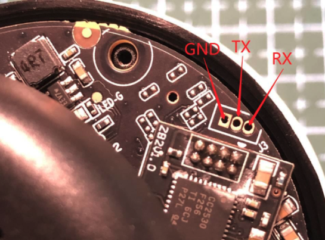

# 硬件
## chips
- **CPU:** hi3518EV200
- **WIFI:** 8188
- **ZIGBEE:** cc2530
- **SENSOR:** ov9732

## pins
- 摄像头正面红绿双色指示灯  

| LED_G|L1 | GPIO8_0 |
--- | --- | ----
LED_R | F2 | GPIO7_4

- 红外灯

| IR_EN|K2 | SAR_ADC_CH1/GPIO7_7 |
--- | --- | ----

- 灯板7P排针

| pin1|RS1 | -引脚  | K1 | SAR_ADC_CH0/GPIO7_6 | 红外接收 |
--- | --- | ---- | --- | ---| ---
| pin2|RS1 | +引脚  | 3.3V | 电源 |  |
| pin3|双色LED公共端 | |  |  |  |
| pin4|LED_G | |  |  |  |
| pin5|LED_R | |  |  |  |
| pin6|IR_LED- | |  |  |  |
| pin7|IR_LED+ | |  |  |  |

- IR_CUT

红线 | 接LDO | 2.8V |
--- | ---| ---
黑线 | AE1511 | 4脚 |
 | AE1511 | 3脚 | J1 | GPIO0_1
 
 
- ZIGBEE排针

| pin1 | | VCC | | |
---|---|---|---|---
| pin2 | nc | | CC2530 | P2_2
| pin3 |  |GND | | |
| pin4 |  | GND| | |
| pin5 | d14 |  UART1_RXD | CC2530 | P0_3| 
| pin6 | nc | | CC2530 | P2_1
| pin7 | e14 | UART1_TXD | CC2530 | P0_2
| pin8 | f1 | GPIO7_5 | CC2530_RST | | 

- 按键

| KEY|N3 | GPIO0_2 |
--- | --- | ----

## UART焊接


# 软件
## PC串口工具

平台 | 工具
---|---
linux | minicom
Mac | screen/minicom
Windows | putty

## 串口设置
- **波特率**： 115200
- **bits**： 8
- **奇偶校验**： none
- **停止位**： 1
- **流控**： none


## 刷固件
1. 下载固件包[firmware-20200420.tar.gz](https://github.com/felix-001/hackboyun/raw/master/firmware/firmware-20200420.tar.gz)
2. sd卡格式化为`fat32`
3. 解压，拷贝到sd卡根目录
  ```
  tar zxvf firmware-20200420.tar.gz
  ```
4. sd卡插到摄像头
5. 烧写uboot
  ```
  sf probe 0
  sf lock 0
  fatload mmc 0 0x82000000 u-boot.20200419.bin
  sf erase 0x0 0x80000
  sf write 0x82000000 0x0 $(filesize)
  reset
  ```
6. reset后,等待新uboot启动,并自动烧写`kernel`和`rootfs`
7. 此时需要拔下sd卡，以免再进入系统再次烧写

### uboot被破坏的解决办法
- 使用`hitool`烧写uboot，详细使用手册见[hitool使用手册](./doc/tools)
- 参考[博云救砖教程](./doc/tools/博云救砖教程.docx)

## 配网
- 设置ssid和passwd
```
vi /etc/config/wireless
```
将`OpenWrt`和`1234567890`替换成自己的
- 联网
```
wifi
```

## 访问openwrt页面
浏览器访问`http://your-camera-ip`

## 查看摄像头实时流
- 通过mjpeg的方式  
浏览器访问`http://your-camera-ip:8080/mjpeg`
- 通过rtsp的方式
  - 电脑或手机安装vlc
  - 启动vlc，选择open network...
  - 输入如下地址：`rtsp://your-camera-ip:554/test.h264`
- 通过mp4的方式  
浏览器访问`http://your-camera-ip:8080/video.mp4`

# 开发

## 开发环境搭建
- 下载海思sdk：`Hi3518E V200R001C01SPC040.rar`,并解压
```
unrar x Hi3518E V200R001C01SPC040.rar
cd 01.software/board
tar zxvf Hi3518E_SDK_V1.0.4.0.tgz
cd Hi3518E_SDK_V1.0.4.0
./sdk.unpack
```
- 安装交叉编译工具链
```
cd osdrv/opensource/toolchain/arm-hisiv300-linux
./cross.install.v30
```
执行这个脚本会把工具链安装在`/opt/hisi-linux/x86-arm/arm-hisiv300-linux/`

- 设置环境变量
```
echo "export PATH=$PATH:/opt/hisi-linux/x86-arm/arm-hisiv300-linux/target/bin" >> ~/.bashrc
source ~/.bashrc
```

## 编译
```
mkdir build
cd build
cmake ..
make
```

目前kernel没有使能NFS，但是fs带了`curl`， 目前比较快的调试办法是PC搭一个http server，程序编译好后，使用curl去下载可执行文件
- curl下载
```
curl http://your-pc-ip:/your-exe > your-exe
```
- 快速搭建http server
```
python -m SimpleHTTPServer 
```

## 文档  
- [ov9732](./doc/sensor)
- [cc2530](./doc/zigbee)
- [救砖教程](./doc/tools/博云救砖教程.docx)

## 控制灯
/sys/devices/dev:gpio7/gpio/gpio62

## ADC
adc相关操作写成了shell脚本:`scripts/adc.sh`

## GPIO
gpio相关操作:`scripts/gpio.sh`

## PWM
pwm相关操作: `scripts/pwm.sh`

